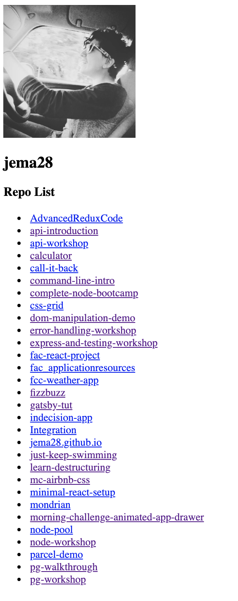

# React with dynamic data code along

In this code along we'll fetch some data from an API and then render it (one of the most common usecases for React in modern frontend). This workshop is based on @sofiapoh's [React Dynamic Data workshop for FAC](https://github.com/sofiapoh/react-dynamic-data-workshop).

## Set up

1. Clone the repo
1. `cd react-dynamic-data-workshop`
1. `npm i`
1. `npm start`

### Getting an access token

Next you'll need a GitHub auth token so you won't get rate limited!

Go to: `Settings > Developer Settings > Personal access tokens > Generate new token`

For this workshop you'll need to select `repo` and `user` scopes. When you get your access token remember to save it somewhere (but don't put it on GitHub). For example, create a file called `token.js` (already in the `.gitignore`) in the root of the workshop folder and put your token there.

```javascript
export const token = 'yourAccessToken'
```

What are we building? A GitHub card with our avatar, username, and list of link of repos:



## Walktrough

Let's start by thinking of our file structure and skeleton code for our index.js and App.js. Our user card will have into two top level class components (so we can access state and lifecycle methods). Based on our design these two top level components will be:

1.  `<UserHeader/>` with our Github avatar and username
2.  `<RepoList/>`, a lists of our repositories with names and links. Our `<RepoList>` will return individual `<Repo>` components.

```
public
--- index.html
src
--- components
------ App
---------index.js
------ Repo
---------index.js
------ RepoList
---------index.js
------ UserHeader
---------index.css
---------index.js
--- utils
------ fetch_data.js
--- index.js
--- token.js
package.json
.gitignore
README.md
```

In our index.js we import React, ReactDOM, App and render it onto the page.

```js
import React from 'react'
import ReactDOM from 'react-dom'
import App from './components/App'

ReactDOM.render(<App />, document.getElementById('root'))
```

In App.js:

```js
import React from 'react'
import UserHeader from '../UserHeader'
import RepoList from '../RepoList'

const App = () => (
  <div>
    <UserHeader />
    <RepoList />
  </div>
)

export default App
```

Note: You can read more about stateless vs. stateful components [here](https://code.tutsplus.com/tutorials/stateful-vs-stateless-functional-components-in-react--cms-29541))

### Creating UserHeader and getting the data

In `UserHeader/index.js` we want to initialise our UserData set to null and render a simple p tag to check our component is rendering.

```js
import React, { Component } from 'react'

class UserHeader extends Component {
  state = { userData: null }

  render() {
    const { userData } = this.state
    return (
      <>
        <p>UserHeader</p>
      </>
    )
  }
}

export default UserHeader
```

Next let's write our getData function in a utils folder (to keep functionality separate). In `utils/fetch_data.js`, write our fetch method:

```js
export const getData = url =>
  fetch(url)
    .then(response => response.json())
    .catch(error => console.log(`Fetch data failed with ${error}`))
```

We then use this function in the componentDidMount lifecycle method, passing in the Github API url, token and username from token.js. Once we get the data we need to set the initial state to the new userData:

```js
import React, { Component } from 'react'
import { getData } from '../../utils/fetch_data'
import { username, token } from '../../token'

class UserHeader extends Component {
  state = { userData: null }

  componentDidMount() {
    getData(
      `https://api.github.com/users/${username}?access_token=${token}`
    ).then(userData => {
      console.log('userheader', userData)
      this.setState({ userData })
    })
  }
  render() {
    const { userData } = this.state
    return (
      <>
        <p>UserHeader</p>
      </>
    )
  }
}

export default UserHeader
```

Now let's use this data:

```js
render() {
  const { userData } = this.state
  return (
    <>
      {!userData ? (
        <p>Loading...</p>
      ) : (
        <div className="UserHeader">
          
          <h2>{userData.login}</h2>
        </div>
      )}
    </>
  )
}
```

The reason we add a conditional render is that data over network gets to us slower than DOM renders content. We need to provide a loading state so we're not trying to render content that is not there yet.

### Creating your repo list component

Next we'll create our `<RepoList/>` component in the same way (with a slightly different url).

```js
import React, { Component } from 'react'
import Repo from './src/components/Repo'
import { getData } from '../../utils/fetch_data'
import { username, token } from '../../token'

class RepoList extends Component {
  state = { repos: null }

  componentDidMount() {
    getData(
      `https://api.github.com/users/${username}/repos?access_token=${token}`
    ).then(repos => {
      console.log('repos', repos)
      this.setState({ repos })
    })
  }

  render() {
    const { repos } = this.state
    return (
      <>
        {!repos ? (
          <p>Loading...</p>
        ) : (
          <div>
            <h3>Repo List</h3>
            <ul>
              {repos.map(repo => (
                <Repo key={repo.id} {...repo} />
              ))}
            </ul>
          </div>
        )}
      </>
    )
  }
}

export default RepoList
```

^ All dynamically rendered components like our `Repo` here need a `key` prop so React can keep track of the correct elements being added/removed from the DOM.

When we render, a very common pattern is to create a functional component for the data that you want to render, map over your data dynamically create a list of these components.

```js
import React from 'react'

const Repo = ({ name, html_url }) => (
  <li>
    <a href={html_url}>{name}</a>
  </li>
)

export default Repo
```

We're done, great job! :sparkles:
